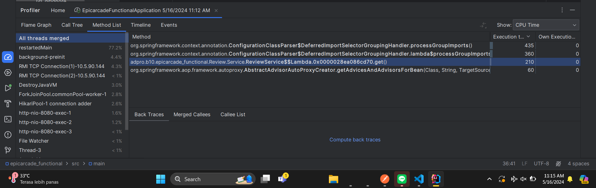
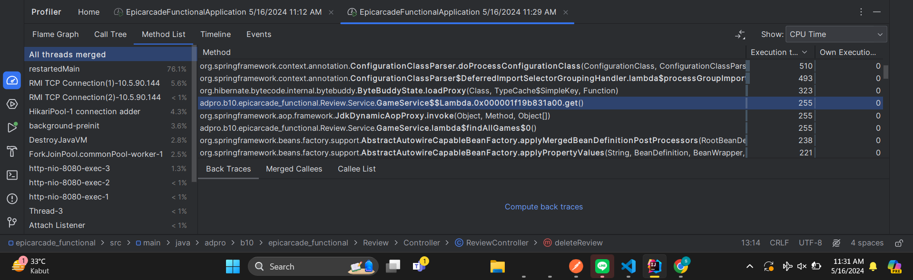
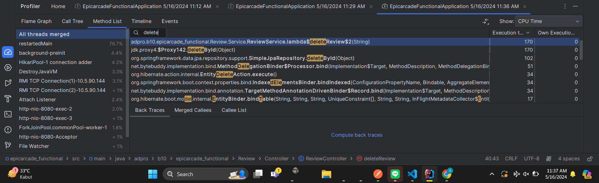
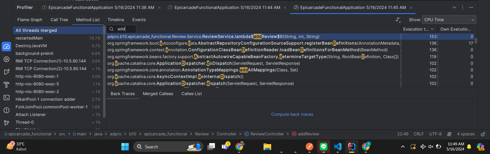

 ## PROFILING FOR `list-reviews`

## PROFILING FOR `games`

## PROFILING FOR `delete-review`

## PROFILING FOR `add-review`

## HASIL ANALISIS

Setelah saya analisis dari pemanggilan 4 metode berbeda, ternyata seluruh method **GET** memiliki execution time terbanyak dari yang lain. Hal ini disebabkan karena method **GET** saya mengambil seluruh data yang dibutuhkan. Saya berasumsi bahwa semua pemrosesan seluruh data memerlukan lebih banyak waktu dibanding yang lain.